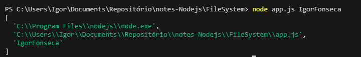

# Progresso e descrição


**Meu progresso no curso**

- [x] Seção 1: Boas-vindas
- [x] Seção 2: Instalando e Explorando Node.js
- [x] Seção 3: Sistema de Módulos do Node.js (App de Notas)
- [ ] Seção 4: Sistema de Arquivos e Argumentos de Linha de Comando (App de Notas)
- [ ] Seção 5: Depuração no Node.js (App de Notas)
- [ ] Seção 6: Node.js Assíncrono (App de Clima)
- [ ] Seção 7: Servidores Web (App de Clima)
- [ ] Seção 8: Acessando API a partir do Navegador (App de Clima)
- [ ] Seção 9: Implantação de Aplicações (App de Clima)
- [ ] Seção 10: MongoDB e Promises (App de Tarefas)
- [ ] Seção 11: APIs REST e Mongoose (App de Tarefas)
- [ ] Seção 12: Autenticação de API e Segurança (App de Tarefas)
- [ ] Seção 13: Ordenação, Paginação e Filtro (App de Tarefas)
- [ ] Seção 14: Upload de Arquivos (App de Tarefas)
- [ ] Seção 15: Enviando E-mails (App de Tarefas)
- [ ] Seção 16: Testando Node.js (App de Tarefas)
- [ ] Seção 17: Aplicações Web em Tempo Real com Socket.io (App de Chat)
- [ ] Seção 18: Conclusão

# Resumo sobre Node.js

Node.js é uma plataforma construída sobre o motor JavaScript V8 do Google Chrome que permite a execução de código JavaScript no lado do servidor. Criada em 2009, sua principal característica é a arquitetura assíncrona e orientada a eventos, utilizando operações não bloqueantes (non-blocking I/O). Essa abordagem torna o Node.js altamente eficiente para lidar com um grande número de conexões simultâneas e aplicações de I/O intensivo.

## Características Principais:

- **Ambiente de Tempo de Execução no Servidor**: Executa JavaScript fora do navegador.
- **Modelo Assíncrono e Baseado em Eventos**: Permite operações não bloqueantes e escalabilidade.
- **NPM (Node Package Manager)**: Um dos maiores gerenciadores de pacotes com mais de 1 milhão de bibliotecas.
- **Ecossistema Vibrante e Comunidade Ativa**: Suporte, ferramentas e bibliotecas diversas.
- **Desenvolvimento Fullstack Unificado**: Mesma linguagem para frontend e backend.

## Casos de Uso Indicados:

- Aplicações de tempo real, como chats e plataformas colaborativas.
- APIs RESTful e microsserviços.
- Servidores de streaming e manipulação de arquivos.
- Ferramentas de automação e linha de comando.

## Quando Evitar:

- **Aplicações Computacionalmente Intensivas**: Pode não ser eficiente para tarefas que exigem processamento pesado de CPU.
- **Operações Sincronas**: O modelo de execução de Node.js não é otimizado para tarefas síncronas.

## Conclusão

Node.js é ideal para construir aplicações escaláveis, eficientes e modernas, com alta capacidade de resposta, sendo uma escolha popular para desenvolvedores fullstack que desejam uma linguagem unificada entre cliente e servidor.

# Seções

| **Seção** | **Título**                                                          | **Descrição**                                                                          | **Aulas** |
| --------- | ------------------------------------------------------------------- | -------------------------------------------------------------------------------------- | --------- |
| Seção 1   | Boas-vindas                                                         | Introdução ao curso, explicando objetivos e estrutura.                                 | 2 aulas   |
| Seção 2   | Instalando e Explorando Node.js                                     | Instalação e configuração do Node.js, explorando os principais recursos da plataforma. | 5 aulas   |
| Seção 3   | Sistema de Módulos do Node.js (App de Notas)                        | Aprendizado do sistema de módulos, com um app de notas para aplicação prática.         | 6 aulas   |
| Seção 4   | Sistema de Arquivos e Argumentos de Linha de Comando (App de Notas) | Manipulação de arquivos e uso de argumentos de linha no app de notas.                  | 6 aulas   |
| Seção 5   | Depuração no Node.js (App de Notas)                                 | Técnicas de depuração no Node.js usando o app de notas como exemplo.                   | 3 aulas   |
| Seção 6   | Node.js Assíncrono (App de Clima)                                   | Uso de operações assíncronas no Node.js, criando um app de clima.                      | 7 aulas   |
| Seção 7   | Servidores Web (App de Clima)                                       | Criação e configuração de servidores web com Node.js no app de clima.                  | 7 aulas   |
| Seção 8   | Acessando API a partir do Navegador (App de Clima)                  | Integração de APIs ao app de clima usando chamadas no navegador.                       | 7 aulas   |
| Seção 9   | Implantação de Aplicações (App de Clima)                            | Práticas para implantar aplicações Node.js e disponibilizar online.                    | 7 aulas   |
| Seção 10  | MongoDB e Promises (App de Tarefas)                                 | Integração com MongoDB e uso de Promises no app de tarefas.                            | 7 aulas   |
| Seção 11  | APIs REST e Mongoose (App de Tarefas)                               | Desenvolvimento de APIs REST usando Mongoose no app de tarefas.                        | 7 aulas   |
| Seção 12  | Autenticação de API e Segurança (App de Tarefas)                    | Implementação de autenticação e segurança no app de tarefas.                           | 8 aulas   |
| Seção 13  | Ordenação, Paginação e Filtro (App de Tarefas)                      | Implementação de ordenação, filtros e paginação em APIs.                               | 7 aulas   |
| Seção 14  | Upload de Arquivos (App de Tarefas)                                 | Integração de upload de arquivos no app de tarefas.                                    | 5 aulas   |
| Seção 15  | Enviando E-mails (App de Tarefas)                                   | Envio programático de e-mails integrados ao app de tarefas.                            | 6 aulas   |
| Seção 16  | Testando Node.js (App de Tarefas)                                   | Técnicas de testes para garantir a qualidade do código no app de tarefas.              | 15 aulas  |
| Seção 17  | Aplicações Web em Tempo Real com Socket.io (App de Chat)            | Criação de aplicações em tempo real utilizando Socket.io com um app de chat.           | 24 aulas  |
| Seção 18  | Conclusão                                                           | Resumo do conteúdo abordado e próximos passos sugeridos.                               | -         |

# Notas de estudos

## Aula 15 - Obtendo inputs de usúario

Linhas de comando no terminal são amplamente usada dentro da programação em diversas linguagens, mas e se
fosse possivel obter os comandos que digitamos no cmd? Como poderiamos realizar operações com eles? Vamos ver tudo isso
nessa nota, mas inicialmente aprenderemos como podemos obter as informações inseridas no terminal

Vamos considerar que no terminal temos digitado o seguinte comando:


temos então o comando **node**, **app.js** e **Igor Fonseca** que podemos extrair dentro do nosso código
para isso fazemos:

```javascript
console.log(process.argv);
```

no código acima usamos o objeto **process** e um de seus métodos **argv** para obter os inputs
inseridos no terminal. Como resultado temos que:



a operação com o argv retorna um array onde podemos obter os dados usando os indexes do elemento dentro do
array

Vamos aplicar esse conhecimento num exemplo simples onde adicionaremos ou removeremos notas a depender
do comando inserido no terminal.

Dentro do nosso arquivo app.js vamos fazer

```javascript
const command = process.argv[2];

if (command === "add") {
  console.log("Sua nota foi adicionada");
} else if (command === "remove") {
  console.log("Sua nota foi removida");
} else {
  console.log("Comando incorreto, use Add ou Remove");
}
```

## Aula 16 - Analisando o argumento com o yargs - part 1

Na ultima aula, vimos como utilizar o **process.argv** para obtemos os
argumentos da linha de comando e criar condicionais com esses comandos. Apesar de util,
o retorno do comando **process.argv** não é capaz de converter todo e qualquer
comando, um vez que interpreta caracteres especiais como parte do comando inserido. Vejamos
um exemplo. Se inserirmos no terminal o comando

```bash
PS C:\FileSystem> node ./app.js myList --title='Comprar suprimentos'

```

vamos ver como retorno no terminal:

```bash
[
  'C:\\Program Files\\nodejs\\node.exe',
  'C:\\UsersFileSystem\\app.js',
  'myList',
  '--title=Comprar suprimentos'
]
```

perceba que os comandos foram interpretados como string sem considerar os caracteres especias. Para podermos criar linhas de comando mais complexas vamos precisar utilizar o
pacote **Yargs**.

O Yargs é uma biblioteca popular para Node.js usada para simplificar a manipulação de argumentos de linha de comando em aplicações. Ele ajuda a processar, interpretar e estruturar argumentos e comandos passados pelo terminal de maneira eficiente e com uma interface amigável. Com o Yargs podemos

1. **Parsear de Argumentos**
2. **Definir comandos**
3. **Validar de Argumentos**
4. **Ajuda e Versão Automáticas**
5. **Suporte a Alias e Abreviações**
6. **Comandos Interativos**

Para instalar o yargs, no terminal do Node dentro do diretório do seu projeto digite:

    npm i yargs

Após a instalação do pacote, devemos importa-lo em nossa aplicação

```javascript
const yargs = require("yargs");
```

Agora estamos prontos para utilizar as funcionalidades desponibilizadas por essa ferramenta. Vamos replicar o exemplo que fizemos acima para entendermos as vantagens de se utilizar o yargs.
Dentro do arquivo **app.js** vamos adicionar a linha:

```javascript
const yargs = require("yargs");

console.log(yargs.argv);
```

Agora no terminal inserimos o mesmo comando inserido no exemplo anterior

```bash
  PS C:\FileSystem> node ./app.js myList --title='Comprar suprimentos'
```

o resultado mostrado no terminal será

```bash
  {
  _: [ 'node', './app.js', 'myList' ],
  title: 'Comprar suprimentos',
  '$0': 'app.js'
  }
```

Isso porque no processo de parseamento da linha de comando o Yargs transforma os argumentos de linha de comando em um objeto JavaScript, permitindo fácil acesso aos valores passados.

**Definir comandos** dentro do yargs,
