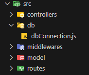
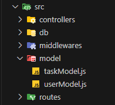
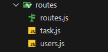
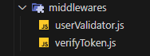
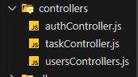

# 🔒 API REST e serviço de Autenticação

Para iniciar o projeto, crie uma pasta onde irá adicionar toda a lógica do projeto e no terminal do VScode instale os seguintes pacotes

## 📌 Pacotes para Autenticação no Node.js

    npm i express mongoose dotenv jsonwebtoken cors cookie_parser nodemon validator argon2

## 📌 Breve descrição pacotes

- **Express** é um framework minimalista para construir APIs e servidores web em Node.js.
- **Mongoose** é uma biblioteca que simplifica a modelagem e manipulação de dados no MongoDB usando esquemas flexíveis.
- **dotenv** é um módulo que permite armazenar informações sensíveis, como chaves secretas e URLs de banco de dados, em um arquivo `.env`.
- **jsonwebtoken (JWT)** é uma biblioteca usada para gerar e validar tokens JWT para autenticação segura.
- **cors** é um middleware que permite ou restringe solicitações de diferentes domínios para a API.
- **cookie-parser** é um middleware que facilita a leitura e manipulação de cookies em requisições HTTP.
- **nodemon** é uma ferramenta que reinicia automaticamente o servidor Node.js quando há alterações no código.
- **validator** é uma biblioteca que fornece validações para dados como e-mails, URLs e números.
- **argon2** é um algoritmo moderno de hashing para senhas, considerado altamente seguro.
- **bcryptjs** é uma alternativa ao Argon2 para criptografar senhas de forma segura.
- **express-rate-limit** é um middleware que limita requisições repetitivas para evitar ataques de força bruta.
- **helmet** é um middleware que melhora a segurança da API definindo cabeçalhos HTTP adequados.
- **morgan** é um logger que registra detalhes das requisições HTTP para facilitar a depuração e monitoramento.

## 1️⃣ - O Servidor

Todo API ou sistema de autenticação precisa de um servidor rodando para ser executado. Criamos o arquivo **server.js** onde colocamos adicionamos o codigo abaixo.

```javascript
require("dotenv").config(); /* Variaveis de ambiente config*/
const express = require("express");

const app = express();

// server config
const port = process.env.port || 3000; //Porta onde será executado nosso servidor

// Database Connection
const { dbConnection, dbEvents } = require("./src/db/dbConnection"); // Arquivo onde armazeno a conexão com a BD

dbConnection();

// Routes
const routes = require("./src/routes/routes");

app.get("/", (req, res) => {
  res.status(200).json({ message: "Bem vindo ao servidor" });
});

// Middlewares
app.use(express.json()); // Permite processar JSON
app.use(express.urlencoded({ extended: true })); // Permite processar dados de formulários
app.use(routes); // Rotas do projeto

// Servidor
dbEvents.on("connected", () => {
  // "on" escuta o evento de conexão da DB e libera o servidor
  app.listen(port, () => {
    console.log("Servidor On");
    console.log("Acesse em http://localhost:3000");
  });
});
```

## 2️⃣ - Conexão base de dados



No **dbConnection.js** temos:

```javascript
const mongoose = require("mongoose");
const Events = require("events");

// Armazena evento que libera base de dados
const dbEvents = new Events();

function dbConnection() {
  mongoose
    .connect(process.env.DB_URL)
    .then(() => {
      dbEvents.emit("connected");
    })
    .catch((error) => {
      console.log(error);
    });
}

module.exports = { dbConnection, dbEvents };
```

## 3️⃣ - Models

Como no nosso projeto os usuários precisam ter conta criada para gerar uma tarefa, vamos focar primeiro em criar a API de autenticação, mas antes precisamos de um Model para adicionarmos usuários no sistema.

### ⚠️ Os métodos apresentados no código abaixo foram adicionados conforme o número a sua frente descreve, além disso dos métodos mostrados abaixo, o único que não precisa ser envocado para funcionar é o _toJSON_ (6°)



```javascript
const mongoose = require("mongoose");
const argon2 = require("argon2");
const validator = require("validator");

const jwt = require("jsonwebtoken");

// 1° - Esquema para user
const userSchema = new mongoose.Schema({
  userName: {
    type: String,
    required: true,
    trim: true,
  },
  email: {
    type: String,
    required: true,
    unique: true,
    trim: true,
  },
  password: {
    type: String,
    required: true,
    trim: true,
  },
  tokens: [
    {
      token: {
        type: String,
        required: true,
      },
    },
  ],
});

// 6° Escondemos passoword e token da resposta para o users
userSchema.methods.toJSON = function () {
  const user = this;

  const userObject = user.toObject();

  delete userObject.password;
  delete userObject.tokens;

  return userObject;
};

// 7° Criamos campo virtual para criar relações entre tabelas user e tasks
userSchema.virtual("tasks", {
  ref: "Task",
  localField: "_id",
  foreignField: "owner",
});

userSchema.set("toObject", { virtuals: true });
userSchema.set("toJSON", { virtuals: true });

// 5° - Método para gerar novo token
userSchema.methods.generateAuthToken = async function () {
  const user = this;
  const token = jwt.sign({ _id: user._id }, process.env.JWT_SECRET, {
    expiresIn: "1 hour",
  });

  if (user.tokens.length >= 3) {
    user.tokens.shift();
  }

  user.tokens?.push({ token });

  await user.save();

  return token;
};

// 4° Método no Model para buscar users na base de dados
userSchema.statics.findByCredentials = async function ({ email, password }) {
  const user = this;

  const existUser = await user.findOne({ email });

  if (!existUser) {
    throw new Error("Usuário não cadastrado");
  }

  const isValid = await argon2.verify(existUser.password, password);

  if (!isValid) {
    throw new Error("Senha inválida");
  }

  return existUser;
};

// 3° - Colocando nome em letra maiscula
userSchema.pre("save", function (next) {
  if (this.userName) {
    this.userName =
      this.userName.charAt(0).toUpperCase() +
      this.userName.slice(1).toLocaleLowerCase();
  }

  next();
});

// 2° - Aqui estamos fazendo um hash da senha antes de salvar a senha
userSchema.pre("save", async function (next) {
  const user = this;

  if (!user.isModified("password")) return next();

  try {
    user.password = await argon2.hash(user.password, {
      type: argon2.argon2id,
      memoryCost: 2 ** 16,
      timeCost: 5,
      parallelism: 1,
    });

    // Explicação das opções:
    // - 'type: argon2.argon2id': Define o tipo de algoritmo de hash. O 'argon2id' é uma versão que combina características de 'argon2d' e 'argon2i' para maior segurança.
    // - 'memoryCost: 2 ** 16': Define a quantidade de memória utilizada no processo de hashing. O valor 2 ** 16 (65536 KiB) aumenta a dificuldade de ataques por força bruta.
    // - 'timeCost: 5': Define o número de iterações realizadas durante o processo de hashing. O valor 5 faz com que o algoritmo seja executado 5 vezes, dificultando ataques.
    // - 'parallelism: 1': Define o número de threads usadas durante o hashing. O valor 1 significa que será executado em uma única thread, mas pode ser aumentado para melhorar a segurança.

    next();
  } catch (error) {
    next(error);
  }
});

const userData = mongoose.model("Users", userSchema);

module.exports = userData;
```

## 3️⃣ - Arquivos de Rotas



## 1️⃣ - **routes.js**

```javascript
const express = require("express");

const router = express.Router();

// Controllers das rotas
const tasks = require("./task");
const users = require("./users");

// Rotas para endpoint Users
router.use("/users", users);
router.use("/tasks", tasks);

module.exports = router;
```

## 2️⃣ - **users.js**

```javascript
const express = require("express");

const route = express.Router();

// Controllers
const userController = require("../controllers/usersControllers");
const authController = require("../controllers/authController");

// Middlewares
const validator = require("../middlewares/userValidator");
const verifyToken = require("../middlewares/verifyToken");

// Rotas públicas
route.post("/login", authController.signIn);
route.post("/signup", validator, authController.signUp);

// Rotas privadas
route.post("/logout", verifyToken, authController.logout);
route.post("/logoutAll", verifyToken, authController.logoutAll);

// Rotas para obter informações pessoais do usuário

// Obter perfil de usuário
route.get("/me", verifyToken, userController.getuserProfileInfo);

// atualizar dados
route.patch("/me", verifyToken, userController.modifyUserInfo);

// excluir conta usuário
route.delete("/me", verifyToken, userController.deleteUser);

module.exports = route;
```

Como podemos ver acima, entre a rota e a resposta no controller, temos um middleware de verificação _Validação_ e um de _Verificação do Token_

## 3️⃣ - Middlewares ⏳



### 3️⃣.1️⃣ - userValidator.js

```javascript
const validator = require("validator");

function response(statusCode, message) {
  return {
    statusCode,
    message,
  };
}

function validate(req, res, next) {
  const { userName, email, password } = req.body;

  if (!userName || userName.length <= 2) {
    return res.send(response(404, "O nome deve conter mais de 2 caracteres"));
  }

  if (!validator.isEmail(email)) {
    return res.send(response(404, "Email inválido"));
  }

  if (!validator.isLength(password, { min: 6 })) {
    return res.send(response(404, "Senha deve conter no minimo 6 caracteres"));
  }

  next();
}

module.exports = validate;
```

### 3️⃣.2️⃣- VerifyToken.js

```javascript
const jwt = require("jsonwebtoken");
const userModel = require("../model/userModel");

async function verifyToken(req, res, next) {
  try {
    const token = req.headers.authorization?.replace("Bearer", "").trim();

    const decoded = jwt.verify(token, process.env.JWT_SECRET);

    const user = await userModel
      .findOne({ _id: decoded._id, "tokens.token": token })
      .select("-password");

    if (!user) {
      throw new Error("Usuário não encontrado");
    }

    req.token = token;
    req.user = user;

    next();
  } catch (error) {
    console.log(error);
    res.status(401).json({ message: error.message });
  }
}

module.exports = verifyToken;
```

Controller com as respostas as solicitações do usuário

## 4️⃣ Controllers



### 4️⃣.1️⃣ - usersController.js

```javascript
const userData = require("../model/userModel");

exports.getuserProfileInfo = async (req, res) => {
  res.status(200).json(req.user);
};

exports.modifyUserInfo = async (req, res) => {
  const keys = Object.keys(req.body);
  const allowedUpdate = ["userName", "email", "password"];

  const isValidOperation = keys.every((updates) =>
    allowedUpdate.includes(updates)
  );

  if (!isValidOperation)
    return res.status(404).json({ message: "Propriedade inválida" });

  try {
    keys.forEach((key) => (req.user[key] = req.body[key]));

    try {
      await req.user.save();
      res
        .status(200)
        .json({ message: "Dados atualizados com sucesso", user: req.user });
    } catch (error) {
      res.status(404).json({ message: error.message });
    }
  } catch (error) {
    return res.status(404).json({ message: error.massage });
  }
};

exports.deleteUser = async (req, res) => {
  try {
    await userData.findByIdAndDelete(req.user._id);

    res.status(200).json({
      message: "Usuário deletado com sucessos",
      user: req.user,
    });
  } catch (error) {
    console.log(error);
  }
};
```

### 2️⃣ - **task.js**

```javascript
const express = require("express");

const router = express.Router();

// Controllers
const taskController = require("../controllers/taskController");

// middlewares
const verifyToken = require("../middlewares/verifyToken");

// Routes
router.get("/", verifyToken, taskController.getTasks);
router.get("/:id", verifyToken, taskController.getTask);
router.post("/", verifyToken, taskController.postTask);
router.patch("/:id", verifyToken, taskController.patchTasks);
router.delete("/:id", verifyToken, taskController.deleteTasks);

module.exports = router;
```

### 🕹️ taskController

```javascript
const taskModel = require("../model/taskModel");
const usersData = require("../model/userModel");

// Rotas para obter tarefas do usuário
exports.getTasks = async (req, res) => {
  try {
    const user = await req.user.populate("tasks");

    if (!user.tasks.length) {
      throw new Error("Não há tarefas adicionadas por esse usuário");
    }

    res.status(200).json({ tasks: req.user.tasks });
  } catch (error) {
    res.status(500).json({ message: error.message });
  }
};

// Rota para obter tarefa do usuário por ID
exports.getTask = async (req, res) => {
  try {
    const _id = req.params.id;

    const task = await taskModel.findOne({ _id, owner: req.user._id });

    if (!task) {
      throw new Error("Tarefa não encontrada");
    }

    res.status(200).json({ task });
  } catch (error) {
    res.status(404).json({ message: error.message });
  }
};

// Rota de postar tarefas
exports.postTask = async (req, res) => {
  try {
    const newTask = new taskModel({ ...req.body, owner: req.user._id });

    try {
      await newTask.save();
    } catch (error) {
      if (error.code === 11000) {
        return res.status(404).json({ message: "Tarefa já existente!" });
      }

      return res.status(404).json({ message: error.message });
    }

    res.status(200).json({ message: "Task saved successfully", task: newTask });
  } catch (error) {
    res.status(404).json({ message: error.message });
  }
};

// Rotas para atualizar tarefas do Usuário
exports.patchTasks = async (req, res) => {
  const updates = Object.keys(req.body);
  const fields = ["description", "completed"];

  const fieldIsdValid = updates.every((update) => fields.includes(update));

  if (!fieldIsdValid) {
    return res.status(404).json({ messagem: "unacknowledged field" });
  }

  try {
    const _id = req.params.id;

    const task = await taskModel.findOne({ _id, owner: req.user._id });

    if (!task) {
      throw new Error("Tarefa não atualizada");
    }

    // Aqui estamos alterando o valor dos dados da task
    // retornada pelo base de dados na busca
    // e trocando pelos dados enviados no corpo da requisição.
    updates.forEach((update) => (task[update] = req.body[update]));

    await task.save();

    res.status(200).json({ task });
  } catch (error) {
    res.status(404).json({ message: error.message });
  }
};

// Rota para deleter tarefas usuário
exports.deleteTasks = async (req, res) => {
  try {
    const task = await taskModel.findByIdAndDelete({
      _id: req.params.id,
      owner: req.user._id,
    });

    if (!task) {
      throw new Error("Task does not exist");
    }

    res.status(200).json({ message: "Removed task", task });
  } catch (error) {
    res.status(404).json({ message: error.message });
  }
};
```
